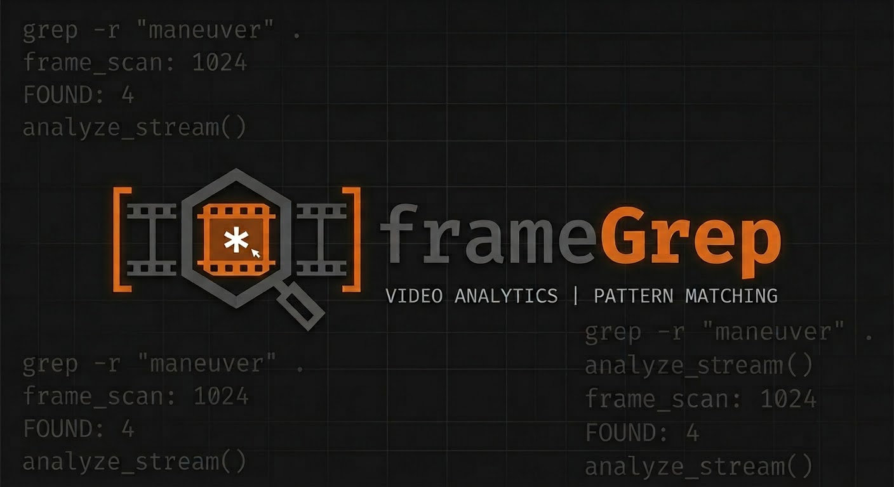

<div align="center">
  
</div>

# frameGrep

**AI-powered clip identification, music suggestion, and export for FPV/drone (and general) footage.**

Upload video, let a vision model find the highlight moments, get royalty-free music
suggestions that match the mood, and export cut-ready clips to your editor. frameGrep
identifies *what's worth keeping* — it hands the actual editing off to DaVinci Resolve,
Premiere, or FFmpeg.

## Features

- **AI highlight detection** — a vision model scans the footage and returns scored clips
  (start/end, description, excitement, mood, lighting, dominant colors).
- **Multiple analysis providers** — cloud (Google Gemini, OpenRouter) or fully local
  (vLLM, llama.cpp/llama-swap, or the purpose-built Marlin-2B clip-ID model). See below.
- **Frame extraction or native video** — send whole video to models that support it, or
  extract frames client-side for those that don't.
- **Royalty-free music suggestions** — analyzes clip mood/energy and queries Jamendo for
  matching Creative Commons tracks, with inline preview.
- **Multi-video batch** — queue several files; each clip tracks its source for exports.
- **Export to real editors** — EDL, FFmpeg script, or FCPXML (DaVinci Resolve), with
  accurate fps/resolution pulled from the file via `mediainfo.js`.
- **Social captions** — generate Instagram / TikTok / YouTube / X captions per clip.

## Analysis providers

| Provider | Where | Notes |
|---|---|---|
| **Gemini** | Cloud | Easiest; native full-video upload; best out-of-the-box accuracy. Needs an API key. |
| **Custom → OpenRouter** | Cloud | Qwen3-VL and other vision models; frame extraction; pay-per-use, no local GPU. |
| **Custom → vLLM** | Local | Native video on your own GPU; private. |
| **Custom → llama-swap** | Local | GGUF models via llama.cpp; frame extraction. |
| **Marlin** | Local | Small 2B model built for clip-ID — auto-captions clips or finds a span from a text query, no prompt engineering. |

Local providers (vLLM, llama-swap, Marlin) and the "which one do I pick?" decision guide
are documented in **[docs/local-inference-cheatsheet.md](docs/local-inference-cheatsheet.md)**.

## Setup

**Prerequisites:** Node.js.

1. Install dependencies:
   ```bash
   npm install
   ```
2. Create `.env.local` with the keys you need (all optional — keys can also be entered in
   the in-app Settings):
   ```bash
   VITE_GEMINI_API_KEY=AIza...                 # Google Gemini
   VITE_OPENROUTER_API_KEY=sk-or-v1-...        # OpenRouter (Custom provider)
   VITE_OPENROUTER_ENDPOINT=https://openrouter.ai/api/v1
   VITE_OPENROUTER_MODEL=qwen/qwen3-vl-8b-instruct
   VITE_JAMENDO_CLIENT_ID=...                  # Music suggestions
   ```
3. Run the dev server (starts at **http://localhost:3007**):
   ```bash
   npm run dev
   ```

## Docs

- **[docs/local-inference-cheatsheet.md](docs/local-inference-cheatsheet.md)** — running the
  local/cloud providers: ports, PM2 services, GPU rules, and how to pick a provider.

## Tech stack

React 19 · Vite 6 · TypeScript · Tailwind CSS · Google Gemini + OpenAI-compatible VLMs ·
`mediainfo.js` (WASM).
